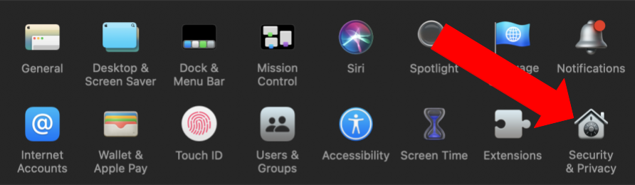
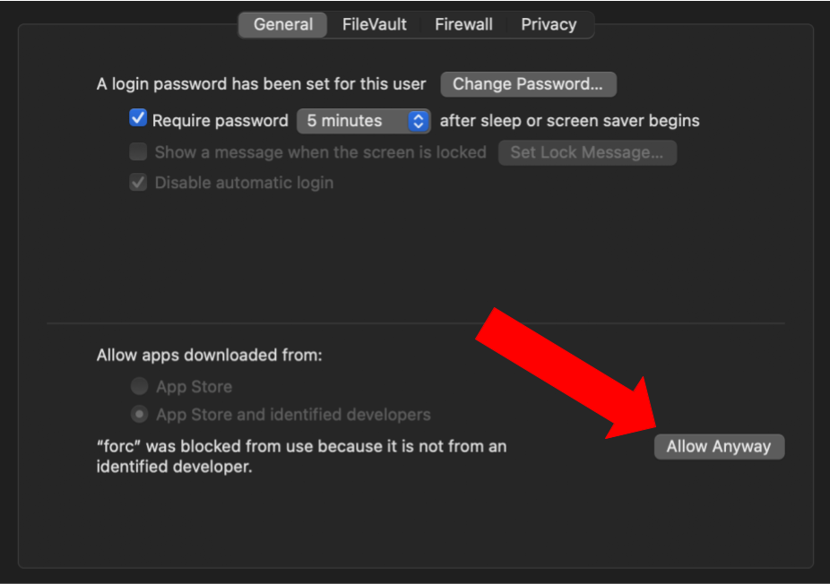

# EthCC Workshop

During this workshop, we will build a smart contract that handles voting with multiple users calling the contract to vote. This demo is DAO-esque, demonstrating many of features that would be used in a full DAO voting contract.

We are writing a smart contract for a group of people who love numbers! They want to be able to keep track of the group's current favorite number and vote on new favorite numbers. The contract will use a governance token to allocate votes, and will allow users to deposit tokens, withdraw tokens, vote on a new favorite number, and execute the contract to count the votes and set a new favorite number.

### Steps:
1. Download this repo
2. [Get set up](#getting-started)
3. [Set up your editor](#editor)
4. [Check out the Sway primer](PRIMER.md) (optional, but recommended)
5. [Build the Token contract](token/README.md)
6. [Build the Voting contract](voting/README.md)
7. [Expand the scope of the demo and keep working](#extensions-😊) (optional!)

## Getting Started

1. Install `cargo` using [`rustup`](https://www.rust-lang.org/tools/install)

    Mac and Linux:
    ```bash
    curl --proto '=https' --tlsv1.2 -sSf https://sh.rustup.rs | sh
    ```

2. Check for correct setup:

    ```bash
    $ cargo --version
    cargo 1.62.0
    ```

3. Install `forc` using [`fuelup`](https://fuellabs.github.io/sway/v0.18.1/introduction/installation.html#installing-from-pre-compiled-binaries)

    Mac and Linux:
    ```bash
    curl --proto '=https' --tlsv1.2 -sSf \
    https://fuellabs.github.io/fuelup/fuelup-init.sh | sh
    ```

4. Check for correct setup:

    ```bash
    $ forc --version
    forc 0.18.1
    ```

    *if that doesn't work*

    
    

## Editor

You are welcome to use your editor of choice.

- [VSCode plugin](https://marketplace.visualstudio.com/items?itemName=FuelLabs.sway-vscode-plugin)
- [Vim highlighting](https://github.com/FuelLabs/sway.vim)

## Extensions 😊

Here is a little list of ideas of how you might expand this example.

1. Add an additional function to the ABI that allows users to unlock votes and put them back into their balance
2. Give a reward to the users who voted for the winning number
3. Change the Voting contract so that it accepts proposals for new favorite numbers, rather than using [0, 99)
4. Expand the scope of what the group votes on---it could be something other than a favorite number
